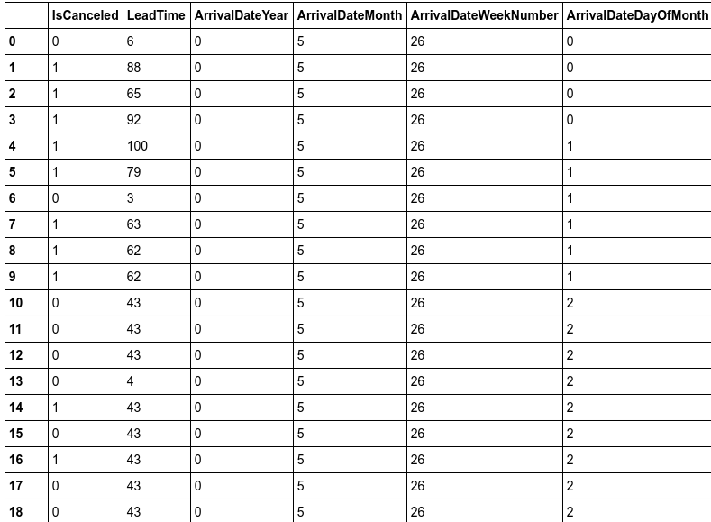

[Home](https://mgcodesandstats.github.io/) |
[Time Series Consulting](https://mgcodesandstats.github.io/time-series-consulting-python-r/) |
[Portfolio](https://mgcodesandstats.github.io/portfolio/) |
[Terms and Conditions](https://mgcodesandstats.github.io/terms/) |
[E-mail me](mailto:contact@michaeljgrogan.com) |
[LinkedIn](https://www.linkedin.com/in/michaeljgrogan/)

# Predicting Hotel Cancellations with ExtraTreesClassifier and Logistic Regression

Hotel cancellations can cause issues for many businesses in the industry. Not only is there the lost revenue as a result of the customer cancelling, but this can also cause difficulty in coordinating bookings and adjusting revenue management practices.

Data analytics can help to overcome this issue, in terms of identifying the customers who are most likely to cancel – allowing a hotel chain to adjust its marketing strategy accordingly.

To investigate how machine learning can aid in this task, I decided to generate a logistic regression in Python to determine whether cancellations can be accurately predicted with this model. The Algarve Hotel dataset available from [Science Direct](https://www.sciencedirect.com/science/article/pii/S2352340918315191) was used to train and validate the model, and then the logistic regression was used to generate predictions on a second dataset for a hotel in Lisbon. A 99% classification accuracy was achieved across the test set predictions.

## Data Processing

At the outset, there is the consideration of **overfitting** when building the model with the data.

For example, in the original H1 file, there were **11,122** cancellations while **28,938** bookings did not cancel. Therefore, non-cancellations could likely end up being overrepresented in the model. For this reason, the H1 dataset was filtered to include **10,000** cancellations and **10,000** non-cancellations.

For the test dataset (H2.csv), **12,000** observations were selected at random, irrespective of whether the booking was cancelled or not.

The relevant libraries were imported and the relevant data type for each variable was classified:

```
import os
import csv
import random
import statsmodels.api as sm
import statsmodels.formula.api as smf
import numpy as np
import pandas as pd
from sklearn.model_selection import train_test_split
from sklearn.linear_model import LogisticRegression
from sklearn.ensemble import ExtraTreesClassifier
from sklearn.preprocessing import MinMaxScaler

dtypes = {
        'IsCanceled':                                    'float64',
        'LeadTime':                                          'float64',
        'StaysInWeekendNights':                                     'float64',
        'StaysInWeekNights':                                     'float64',
        'Adults':                            'float64',
        'Children':                            'float64',
        'Babies':                                  'float64',
        'Meal':                                    'category',
        'Country':                                               'category',
        'MarketSegment':                                    'category',
        'DistributionChannel':                                       'category',
        'IsRepeatedGuest':                               'float64',
        'PreviousCancellations':                                    'float64',
        'PreviousBookingsNotCanceled':                          'float64',
        'ReservedRoomType':                                             'category',
        'AssignedRoomType':                                            'category',
        'BookingChanges':                                                'float64',
        'DepositType':                                              'category',
        'Agent':                                              'category',
        'Company':                                 'category',
        'DaysInWaitingList':                                           'float64',
        'CustomerType':                                           'category',
        'ADR':                                          'float64',
        'RequiredCarParkingSpaces':                                      'float64',
        'TotalOfSpecialRequests':                                              'float64',
        'ReservationStatus':                                                'category'
        }
```

As we can see, there are many variables that can potentially influence whether a customer is going to cancel or not, and not all of these variables will necessarily be relevant in determining this.

The data is imported, and then the data is factorized so as to express the categories in numerical format:

```
train_df = pd.read_csv('H1.csv', dtype=dtypes)
a=train_df.head()
b=train_df
b

data=b.apply(lambda col: pd.factorize(col, sort=True)[0])
data
```


The variables are then stacked together under the numpy format:

```
IsCanceled = data['IsCanceled']
y = IsCanceled
leadtime = data['LeadTime'] #1
staysweekendnights = data['StaysInWeekendNights'] #2
staysweeknights = data['StaysInWeekNights'] #3
adults = data['Adults'] #4
children = data['Children'] #5
babies = data['Babies'] #6
meal = data['Meal'] #7
country = data['Country'] #8
marketsegment = data['MarketSegment'] #9
distributionchannel = data['DistributionChannel'] #10
isrepeatedguest = data['IsRepeatedGuest'] #11
previouscancellations = data['PreviousCancellations'] #12
previousbookingsnotcanceled = data['PreviousBookingsNotCanceled'] #13
reservedroomtype = data['ReservedRoomType'] #14
assignedroomtype = data['AssignedRoomType'] #15
bookingchanges = data['BookingChanges'] #16
deptype = data['DepositType'] #17
agent = data['Agent'] #18
company = data['Company'] #19
dayswaitinglist = data['DaysInWaitingList'] #20
custype = data['CustomerType'] #21
adr = data['ADR'] #22
rcps = data['RequiredCarParkingSpaces'] #23
totalsqr = data['TotalOfSpecialRequests'] #24
reserv = data['ReservationStatus'] #25

x = np.column_stack((leadtime,staysweekendnights,staysweeknights,adults,children,babies,meal,country,marketsegment,distributionchannel,isrepeatedguest,previouscancellations,previousbookingsnotcanceled,reservedroomtype,assignedroomtype,bookingchanges,deptype,agent,company,dayswaitinglist,custype,adr,rcps,totalsqr,reserv))
x = sm.add_constant(x, prepend=True)
y=y.values
```

## Extra Trees Classifier

As mentioned, there are many variables included in the analysis – not all of them will be relevant in determining whether a customer is likely to cancel or not.

To solve this issue, the Extra Trees Classifier is used to print the importance of each variable in numerical format, and the variables with the highest ranked importance are then chosen accordingly.

```
from sklearn.ensemble import ExtraTreesClassifier
model = ExtraTreesClassifier()
model.fit(x, y)
print(model.feature_importances_)
```

Here are the generated readings:

```
[0.00000000e+00 2.64547601e-02 3.76477525e-03 1.02176989e-02
 2.03326905e-03 4.70831050e-03 2.94376622e-04 2.50857973e-03
 5.85259965e-02 1.48634627e-02 7.68438817e-03 5.50781494e-03
 8.19894673e-03 6.67289269e-04 2.34311227e-03 4.33907043e-03
 3.37021921e-03 4.23563715e-02 8.46898382e-03 1.69590164e-03
 2.77019676e-04 9.73881159e-03 9.06862237e-03 3.56449786e-02
 5.91657374e-03 7.31350667e-01]
```
From the above, the identified features of importance are lead time, country, market segment, deposit type, customer type, and reservation status.

The variables are redefined in the stack:

```
y1 = y
x1 = np.column_stack((leadtime,country,marketsegment,deptype,custype,reserv))
x1 = sm.add_constant(x1, prepend=True)
```

## Logistic Regression

Now, the logistic regression is generated:

```
x1_train, x1_test, y1_train, y1_test = train_test_split(x1, y1, random_state=0)

logreg = LogisticRegression().fit(x1_train,y1_train)
logreg

print("Training set score: {:.3f}".format(logreg.score(x1_train,y1_train)))

print("Test set score: {:.3f}".format(logreg.score(x1_test,y1_test)))

import statsmodels.api as sm
logit_model=sm.Logit(y1,x1)
result=logit_model.fit()
print(result.summary())
```

Here are the results:

```
Training set score: 0.993
Test set score: 0.992
Optimization terminated successfully.
         Current function value: 0.100929
         Iterations 8
                           Logit Regression Results                           
==============================================================================
Dep. Variable:                      y   No. Observations:                40058
Model:                          Logit   Df Residuals:                    40051
Method:                           MLE   Df Model:                            6
Date:                Tue, 14 May 2019   Pseudo R-squ.:                  0.8291
Time:                        19:05:49   Log-Likelihood:                -4043.0
converged:                       True   LL-Null:                       -23662.
                                        LLR p-value:                     0.000
==============================================================================
                 coef    std err          z      P>|z|      [0.025      0.975]
------------------------------------------------------------------------------
const          1.5074      0.214      7.029      0.000       1.087       1.928
x1             0.0014      0.000      3.706      0.000       0.001       0.002
x2             0.0184      0.001     14.251      0.000       0.016       0.021
x3             0.1697      0.027      6.223      0.000       0.116       0.223
x4             1.1369      0.125      9.090      0.000       0.892       1.382
x5            -0.0812      0.060     -1.345      0.179      -0.199       0.037
x6            -7.2326      0.075    -96.874      0.000      -7.379      -7.086
==============================================================================
```

Now, the logistic regression is used to predict cancellations for the test data, and a confusion matrix is generated to determine the incidence of true/false positives and negatives:

```
pr = logreg.predict(x1_test)
from sklearn.metrics import classification_report,confusion_matrix
print(confusion_matrix(y1_test,pr))
print(classification_report(y1_test,pr))
```

The confusion matrix is generated:

```
[[7267    0]
 [  76 2672]]
              precision    recall  f1-score   support

           0       0.99      1.00      0.99      7267
           1       1.00      0.97      0.99      2748

   micro avg       0.99      0.99      0.99     10015
   macro avg       0.99      0.99      0.99     10015
weighted avg       0.99      0.99      0.99     10015
```

From the above, we see that the accuracy in classification was quite high.

Here is an ROC curve illustrating the true vs false positive rate.

```
import matplotlib.pyplot as plt
from sklearn.metrics import roc_curve
falsepos,truepos,thresholds=roc_curve(y1_test,logreg.decision_function(x1_test))
plt.plot(falsepos,truepos,label="ROC")
plt.xlabel("False Positive Rate")
plt.ylabel("True Positive Rate")
cutoff=np.argmin(np.abs(thresholds))
plt.plot(falsepos[cutoff],truepos[cutoff],'o',markersize=10,label="cutoff",fillstyle="none")
plt.show()
```


## Testing against unseen data

Now that the logistic regression has shown a high degree of classification accuracy against the validation dataset, another dataset H2.csv (also available from Science direct) is used for comparison purposes, i.e. the logistic regression generated using the last dataset is now used to predict classifications across this dataset (for a different hotel located in Lisbon, Portugal).

The second dataset is loaded using pandas, and the relevant variables are factorized:

```
h2data = pd.read_csv('H2.csv', dtype=dtypes)
a=h2data.head()
b=h2data
b

seconddata=b.apply(lambda col: pd.factorize(col, sort=True)[0])
seconddata
```




The new variables are sorted into a numpy column stack, and a logistic regression is run:

```
leadtime = seconddata['LeadTime'] #1
staysweekendnights = seconddata['StaysInWeekendNights'] #2
staysweeknights = seconddata['StaysInWeekNights'] #3
adults = seconddata['Adults'] #4
children = seconddata['Children'] #5
babies = seconddata['Babies'] #6
meal = seconddata['Meal'] #7
country = seconddata['Country'] #8
marketsegment = seconddata['MarketSegment'] #9
distributionchannel = seconddata['DistributionChannel'] #10
isrepeatedguest = seconddata['IsRepeatedGuest'] #11
previouscancellations = seconddata['PreviousCancellations'] #12
previousbookingsnotcanceled = seconddata['PreviousBookingsNotCanceled'] #13
reservedroomtype = seconddata['ReservedRoomType'] #14
assignedroomtype = seconddata['AssignedRoomType'] #15
bookingchanges = seconddata['BookingChanges'] #16
deptype = seconddata['DepositType'] #17
agent = seconddata['Agent'] #18
company = seconddata['Company'] #19
dayswaitinglist = seconddata['DaysInWaitingList'] #20
custype = seconddata['CustomerType'] #21
adr = seconddata['ADR'] #22
rcps = seconddata['RequiredCarParkingSpaces'] #23
totalsqr = seconddata['TotalOfSpecialRequests'] #24
reserv = seconddata['ReservationStatus'] #25


a = np.column_stack((leadtime,country,marketsegment,deptype,custype,reserv))
a = sm.add_constant(a, prepend=True)
IsCanceled = seconddata['IsCanceled']
b = IsCanceled
b=b.values

prh2 = logreg.predict(a)
prh2
```

The array of predictions is generated once again:

```
array([0, 1, 1, ..., 0, 0, 0])
```

A classification matrix is generated:

```
from sklearn.metrics import classification_report,confusion_matrix
print(confusion_matrix(b,prh2))
print(classification_report(b,prh2))
```

**Classification Output**

```
[[46228     0]
 [  916 32186]]
              precision    recall  f1-score   support

           0       0.98      1.00      0.99     46228
           1       1.00      0.97      0.99     33102

   micro avg       0.99      0.99      0.99     79330
   macro avg       0.99      0.99      0.99     79330
weighted avg       0.99      0.99      0.99     79330
```

The ROC curve is generated:

```
import matplotlib.pyplot as plt
from sklearn.metrics import roc_curve
falsepos,truepos,thresholds=roc_curve(b,logreg.decision_function(a))
plt.plot(falsepos,truepos,label="ROC")
plt.xlabel("False Positive Rate")
plt.ylabel("True Positive Rate")

cutoff=np.argmin(np.abs(thresholds))
plt.plot(falsepos[cutoff],truepos[cutoff],'o',markersize=10,label="cutoff",fillstyle="none")
plt.show()
```


In addition to generating a binary prediction (i.e. 1 = cancellation, 0 = no cancellation), the probability of cancellation can also be generated. In the **H2** dataset, two random observations were selected with the relevant values for the explanatory variables plugged into the logistic regression. In the case of the customer that did not cancel, a low probability of 3% is observed, whereas a probability of over 98% is observed for the customer that did cancel.

```
# Odds of not cancelling for random H2 customer (customer did not cancel)
# leadtime, country, marketsegment, deptype, custype, reserv
sum1=1.5074+(0.0014*3)+(0.0184*100)+(0.1697*4)+(1.1369*0)-(0.0812*3)-(7.2326*1)
odds=np.exp(sum1)
probability1=odds/(1+odds)
probability1
```

Probability:

```
0.030894359478570665
```

Here is the probability for the customer that did cancel:

```
# Odds of cancelling for random H2 customer (customer did cancel)
# leadtime, country, marketsegment, deptype, custype, reserv
sum2=1.5074+(0.0014*100)+(0.0184*100)+(0.1697*6)+(1.1369*0)-(0.0812*2)-(7.2326*0)
odds=np.exp(sum2)
probability2=odds/(1+odds)
probability2
```

Probability:

```
0.987171822610922
```

# Conclusion
This has been an illustration of how a logistic regression can be used to predict hotel cancellations. We have also seen how the Extra Trees Classifier can be used as a feature selection tool to identify the most reliable predictors of customer cancellations.
