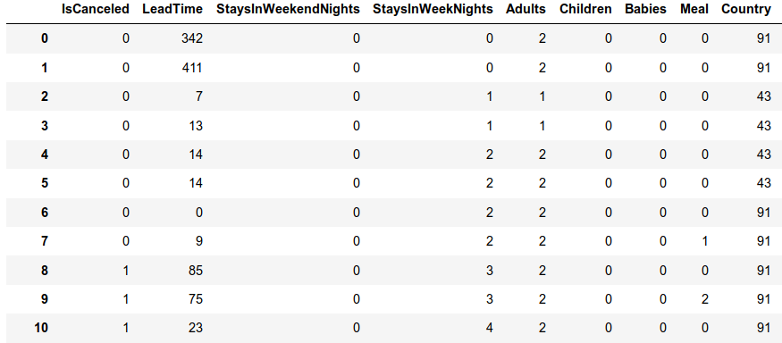
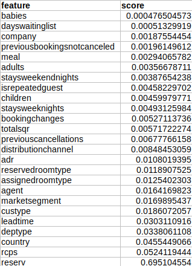
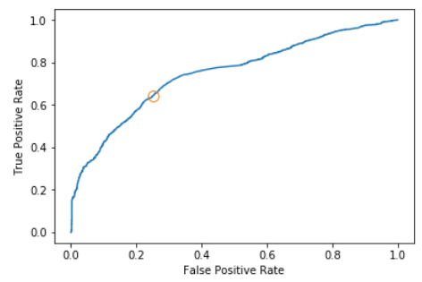
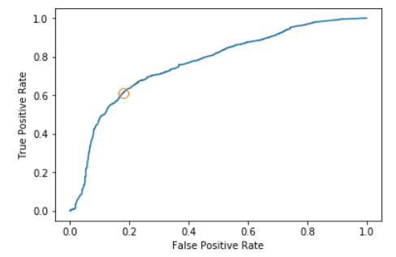
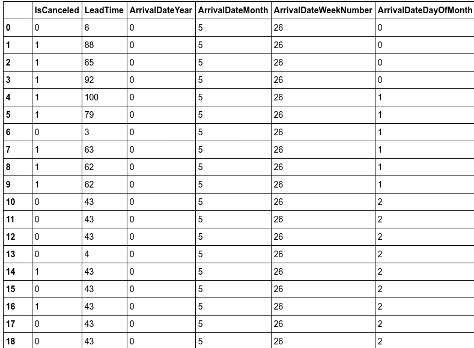
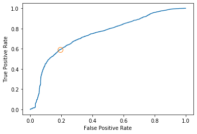

[Home](https://mgcodesandstats.github.io/) |
[Portfolio](https://mgcodesandstats.github.io/portfolio/) |
[Terms and Conditions](https://mgcodesandstats.github.io/terms/) |
[E-mail me](mailto:contact@michaeljgrogan.com) |
[LinkedIn](https://www.linkedin.com/in/michaeljgrogan/)

# Predicting Hotel Cancellations with ExtraTreesClassifier and Support Vector Machines

Hotel cancellations can cause issues for many businesses in the industry. Not only is there the lost revenue as a result of the customer cancelling, but this can also cause difficulty in coordinating bookings and adjusting revenue management practices.

Data analytics can help to overcome this issue, in terms of identifying the customers who are most likely to cancel – allowing a hotel chain to adjust its marketing strategy accordingly.

To investigate how machine learning can aid in this task, the **ExtraTreesClassifer**, **logistic regression**, and **support vector machine** models were employed in Python to determine whether cancellations can be accurately predicted with this model. For this example, both hotels are based in Portugal. The Algarve Hotel dataset available from [Science Direct](https://www.sciencedirect.com/science/article/pii/S2352340918315191) was used to train and validate the model, and then the logistic regression was used to generate predictions on a second dataset for a hotel in Lisbon.

## Data Processing

At the outset, there is the consideration of **overfitting** when building the model with the data.

For example, in the original H1 file, there were **11,122** cancellations while **28,938** bookings did not cancel. Therefore, non-cancellations could likely end up being overrepresented in the model. For this reason, the H1 dataset was filtered to include **10,000** cancellations and **10,000** non-cancellations.

For the test dataset (H2.csv), **12,000** observations were selected at random, irrespective of whether the booking was cancelled or not.

The relevant libraries were imported and the relevant data type for each variable was classified:

```
import os
import csv
import random
import statsmodels.api as sm
import statsmodels.formula.api as smf
import numpy as np
import pandas as pd
from sklearn.model_selection import train_test_split
from sklearn.linear_model import LogisticRegression
from sklearn.ensemble import ExtraTreesClassifier
from sklearn.preprocessing import MinMaxScaler

dtypes = {
        'IsCanceled':                                    'float64',
        'LeadTime':                                          'float64',
        'StaysInWeekendNights':                                     'float64',
        'StaysInWeekNights':                                     'float64',
        'Adults':                            'float64',
        'Children':                            'float64',
        'Babies':                                  'float64',
        'Meal':                                    'category',
        'Country':                                               'category',
        'MarketSegment':                                    'category',
        'DistributionChannel':                                       'category',
        'IsRepeatedGuest':                               'float64',
        'PreviousCancellations':                                    'float64',
        'PreviousBookingsNotCanceled':                          'float64',
        'ReservedRoomType':                                             'category',
        'AssignedRoomType':                                            'category',
        'BookingChanges':                                                'float64',
        'DepositType':                                              'category',
        'Agent':                                              'category',
        'Company':                                 'category',
        'DaysInWaitingList':                                           'float64',
        'CustomerType':                                           'category',
        'ADR':                                          'float64',
        'RequiredCarParkingSpaces':                                      'float64',
        'TotalOfSpecialRequests':                                              'float64',
        'ReservationStatus':                                                'category'
        }
```

As we can see, there are many variables that can potentially influence whether a customer is going to cancel or not, and not all of these variables will necessarily be relevant in determining this.

The data is imported, and then the data is factorized so as to express the categories in numerical format:

```
train_df = pd.read_csv('H1.csv', dtype=dtypes)
a=train_df.head()
b=train_df
b

data=b.apply(lambda col: pd.factorize(col, sort=True)[0])
data
```



The variables are then stacked together under the numpy format:

```
IsCanceled = data['IsCanceled']
y = IsCanceled
leadtime = data['LeadTime'] #1
staysweekendnights = data['StaysInWeekendNights'] #2
staysweeknights = data['StaysInWeekNights'] #3
adults = data['Adults'] #4
children = data['Children'] #5
babies = data['Babies'] #6
meal = data['Meal'] #7
country = data['Country'] #8
marketsegment = data['MarketSegment'] #9
distributionchannel = data['DistributionChannel'] #10
isrepeatedguest = data['IsRepeatedGuest'] #11
previouscancellations = data['PreviousCancellations'] #12
previousbookingsnotcanceled = data['PreviousBookingsNotCanceled'] #13
reservedroomtype = data['ReservedRoomType'] #14
assignedroomtype = data['AssignedRoomType'] #15
bookingchanges = data['BookingChanges'] #16
deptype = data['DepositType'] #17
agent = data['Agent'] #18
company = data['Company'] #19
dayswaitinglist = data['DaysInWaitingList'] #20
custype = data['CustomerType'] #21
adr = data['ADR'] #22
rcps = data['RequiredCarParkingSpaces'] #23
totalsqr = data['TotalOfSpecialRequests'] #24
reserv = data['ReservationStatus'] #25

x = np.column_stack((leadtime,staysweekendnights,staysweeknights,adults,children,babies,meal,country,marketsegment,distributionchannel,isrepeatedguest,previouscancellations,previousbookingsnotcanceled,reservedroomtype,assignedroomtype,bookingchanges,deptype,agent,company,dayswaitinglist,custype,adr,rcps,totalsqr,reserv))
x = sm.add_constant(x, prepend=True)
y=y.values
```

## Extra Trees Classifier

As mentioned, there are many variables included in the analysis – not all of them will be relevant in determining whether a customer is likely to cancel or not.

To solve this issue, the Extra Trees Classifier is used to print the importance of each variable in numerical format, and the variables with the highest ranked importance are then chosen accordingly.

```
from sklearn.ensemble import ExtraTreesClassifier
model = ExtraTreesClassifier()
model.fit(x, y)
print(model.feature_importances_)
```

Here are the generated readings:

```
[0.00000000e+00 2.36504430e-02 2.65915082e-03 3.40313029e-03
 3.50712001e-03 1.67339965e-03 2.97023878e-04 1.58653873e-03
 3.91496135e-02 1.85636966e-02 2.22467425e-03 5.43228409e-03
 5.89261930e-03 9.18391152e-04 2.70472970e-03 6.05852112e-03
 5.39940598e-03 2.44619382e-02 8.44330541e-03 1.28580667e-03
 5.00680306e-04 9.39879434e-03 5.81957644e-03 6.67617266e-02
 4.81097875e-03 7.55396451e-01]
```
Here is a breakdown of the feature importance in Excel format:



From the above, the top six identified features of importance are **reservation status**, **country**, **required car parking spaces**, **deposit type**, **customer type**, and **lead time**.

However, a couple of caveats worth mentioning:

- **Reservation status** cannot be used to predict hotel cancellations as the two are highly correlated, i.e. if the reservation status is cancelled, then this variable will already reflect this.

- When an initial logistic regression was run, **customer type** and **required car parking spaces** were shown as insignificant. Therefore, the regression was run again as below with these variables having been dropped from the model.

## Logistic Regression

The data was split into training and test data, and the logistic regression was generated:

```
x1_train, x1_test, y1_train, y1_test = train_test_split(x1, y1, random_state=0)

logreg = LogisticRegression().fit(x1_train,y1_train)
logreg

print("Training set score: {:.3f}".format(logreg.score(x1_train,y1_train)))
print("Test set score: {:.3f}".format(logreg.score(x1_test,y1_test)))
```
The following training and test set scores were generated:
```
Training set score: 0.699
Test set score: 0.697
```
Then, the coefficients for the logistic regression itself were generated:

```
import statsmodels.api as sm
logit_model=sm.Logit(y1,x1)
result=logit_model.fit()
print(result.summary())
```

Here are the updated results:

```
Optimization terminated successfully.
         Current function value: 0.596248
         Iterations 7
                           Logit Regression Results                           
==============================================================================
Dep. Variable:                      y   No. Observations:                20000
Model:                          Logit   Df Residuals:                    19996
Method:                           MLE   Df Model:                            3
Date:                Wed, 05 Jun 2019   Pseudo R-squ.:                  0.1398
Time:                        13:39:05   Log-Likelihood:                -11925.
converged:                       True   LL-Null:                       -13863.
                                        LLR p-value:                     0.000
==============================================================================
                 coef    std err          z      P>|z|      [0.025      0.975]
------------------------------------------------------------------------------
const         -2.1536      0.050    -43.353      0.000      -2.251      -2.056
x1             0.0056      0.000     32.378      0.000       0.005       0.006
x2             0.0237      0.001     36.517      0.000       0.022       0.025
x3             2.1095      0.104     20.360      0.000       1.906       2.313
==============================================================================
```

Now, the logistic regression is used to predict cancellations for the test data, and a confusion matrix is generated to determine the incidence of true/false positives and negatives:

```
pr = logreg.predict(x1_test)
from sklearn.metrics import classification_report,confusion_matrix
print(confusion_matrix(y1_test,pr))
print(classification_report(y1_test,pr))
```

The confusion matrix is generated:

```
[[1898  633]
 [ 883 1586]]
              precision    recall  f1-score   support

           0       0.68      0.75      0.71      2531
           1       0.71      0.64      0.68      2469

   micro avg       0.70      0.70      0.70      5000
   macro avg       0.70      0.70      0.70      5000
weighted avg       0.70      0.70      0.70      5000
```

Here is an ROC curve illustrating the true vs false positive rate.

```
import matplotlib.pyplot as plt
from sklearn.metrics import roc_curve
falsepos,truepos,thresholds=roc_curve(y1_test,logreg.decision_function(x1_test))
plt.plot(falsepos,truepos,label="ROC")
plt.xlabel("False Positive Rate")
plt.ylabel("True Positive Rate")
cutoff=np.argmin(np.abs(thresholds))
plt.plot(falsepos[cutoff],truepos[cutoff],'o',markersize=10,label="cutoff",fillstyle="none")
plt.show()
```



## Support Vector Machine (SVM) generation

The above model has shown a **69%** classification accuracy in determining whether a customer will cancel. The prediction for non-cancellations was **68%** based on precision while it was **71%** for cancellations (also based on precision).

Therefore, an SVM was generated using the training and validation data to determine whether this model would yield higher classification accuracy.

```
from sklearn import svm
clf = svm.SVC(gamma='scale')
clf.fit(x1, y1)  
prclf = clf.predict(x1_test)
prclf
```

A new prediction array is generated:

```
array([1, 0, 0, ..., 1, 1, 0])
```

Here is the new ROC curve generated:



This is the updated confusion matrix:

```
[[2078  453]
 [ 961 1508]]
              precision    recall  f1-score   support

           0       0.68      0.82      0.75      2531
           1       0.77      0.61      0.68      2469

   micro avg       0.72      0.72      0.72      5000
   macro avg       0.73      0.72      0.71      5000
weighted avg       0.73      0.72      0.71      5000
```

The overall accuracy has increased to **71%**, but note that the predictive accuracy for cancellations specifically has improved quite significantly to **77%**, while it remains at **68%** for non-cancellations.

## Testing against unseen data

Now that the SVM has shown improved accuracy against the validation dataset, another dataset H2.csv (also available from Science direct) is used for comparison purposes, i.e. the SVM generated using the last dataset is now used to predict classifications across this dataset (for a different hotel located in Lisbon, Portugal).

The second dataset is loaded using pandas, and the relevant variables are factorized:

```
h2data = pd.read_csv('H2.csv', dtype=dtypes)
a=h2data.head()
b=h2data
b

seconddata=b.apply(lambda col: pd.factorize(col, sort=True)[0])
seconddata
```




The new variables are sorted into a numpy column stack, and a logistic regression is run:

```
leadtime = seconddata['LeadTime'] #1
staysweekendnights = seconddata['StaysInWeekendNights'] #2
staysweeknights = seconddata['StaysInWeekNights'] #3
adults = seconddata['Adults'] #4
children = seconddata['Children'] #5
babies = seconddata['Babies'] #6
meal = seconddata['Meal'] #7
country = seconddata['Country'] #8
marketsegment = seconddata['MarketSegment'] #9
distributionchannel = seconddata['DistributionChannel'] #10
isrepeatedguest = seconddata['IsRepeatedGuest'] #11
previouscancellations = seconddata['PreviousCancellations'] #12
previousbookingsnotcanceled = seconddata['PreviousBookingsNotCanceled'] #13
reservedroomtype = seconddata['ReservedRoomType'] #14
assignedroomtype = seconddata['AssignedRoomType'] #15
bookingchanges = seconddata['BookingChanges'] #16
deptype = seconddata['DepositType'] #17
agent = seconddata['Agent'] #18
company = seconddata['Company'] #19
dayswaitinglist = seconddata['DaysInWaitingList'] #20
custype = seconddata['CustomerType'] #21
adr = seconddata['ADR'] #22
rcps = seconddata['RequiredCarParkingSpaces'] #23
totalsqr = seconddata['TotalOfSpecialRequests'] #24
reserv = seconddata['ReservationStatus'] #25


a = np.column_stack((leadtime,country,deptype))
a = sm.add_constant(a, prepend=True)
IsCanceled = seconddata['IsCanceled']
b = IsCanceled
b=b.values

prh2 = clf.predict(a)
prh2
```

The array of predictions is generated once again:

```
array([0, 0, 1, ..., 0, 1, 0])
```

A classification matrix is generated:

```
from sklearn.metrics import classification_report,confusion_matrix
print(confusion_matrix(b,prh2))
print(classification_report(b,prh2))
```

**Classification Output**

```
[[5652 1352]
 [1993 3003]]
              precision    recall  f1-score   support

           0       0.74      0.81      0.77      7004
           1       0.69      0.60      0.64      4996

   micro avg       0.72      0.72      0.72     12000
   macro avg       0.71      0.70      0.71     12000
weighted avg       0.72      0.72      0.72     12000
```

The ROC curve is generated:



Across the test set, the overall prediction accuracy increased to **72%**, while the accuracy for cancellation incidences fell slightly to **69%**.

```
metrics.auc(falsepos, truepos)
```
The computed AUC (area under the curve) is **0.74**.

```
0.7434473849782282
```

# Conclusion
This has been an illustration of how logistic regression and SVM models can be used to predict hotel cancellations. We have also seen how the Extra Trees Classifier can be used as a feature selection tool to identify the most reliable predictors of customer cancellations.

Of course, a limitation of these findings is that both hotels under study are based in Portugal. Testing the model across hotels in other countries would help to validate the accuracy of this model further.
